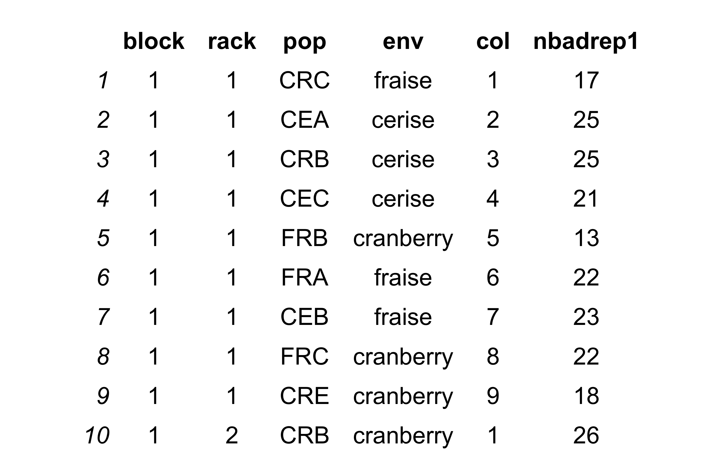

```{r, echo=FALSE, message=FALSE}
knitr::opts_chunk$set(error = TRUE)
devtools::install_deps(upgrade = "never")
devtools::load_all()
```

# Create png
## Simulate data
```{r, message=FALSE}
createpng(csvpath="./../data/FitnessExperimentalDesign_G60Final.csv", outputpng="./../data/testnew.png")
```
## Initial image


# Run OCR
## English, no cleaning
```{r}

data <- ocrpng(impagepath = "./../data/test.png", n.col=NULL, lang="eng",  header=TRUE, cleaning=FALSE, outcsv="./../output/fitnessOCR.csv")

```
## French, cleaning
```{r}

data <- ocrpng(impagepath = "./../data/test.png", n.col=NULL, lang="fra",  header=TRUE, cleaning=TRUE, outcsv="./../output/fitnessOCR.csv")

```
# Visualisation des donnees

Moyenne pour chaque population dans chaque environnement
```{r}
graphe(csvpath="./../data/fitness.csv")
```

# Comparaison des groupes

```{r }
analyse_stat(csvpath="./../data/fitness.csv")
```

